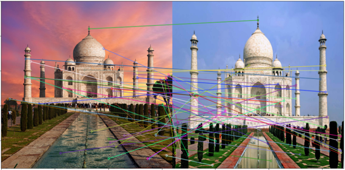
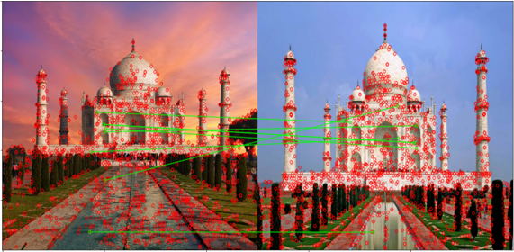
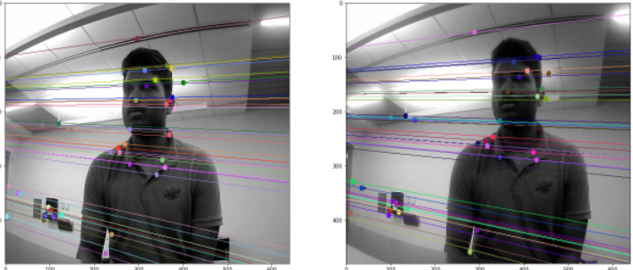
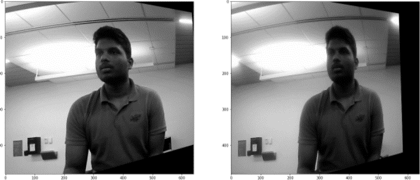
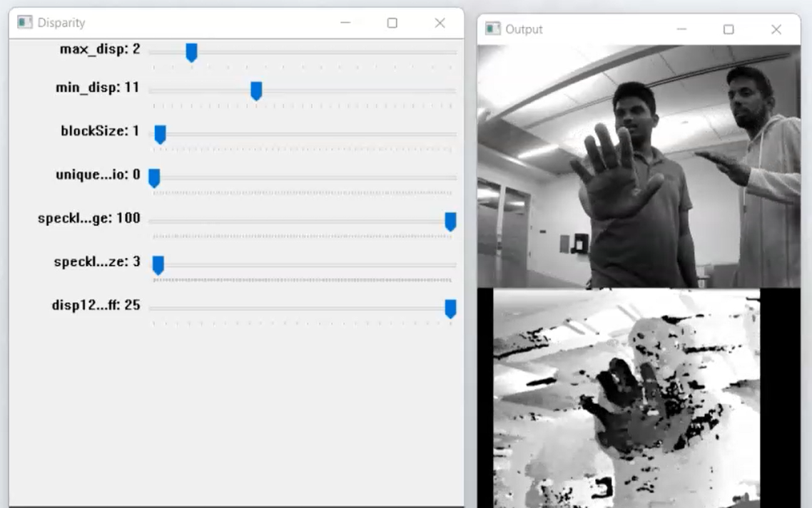
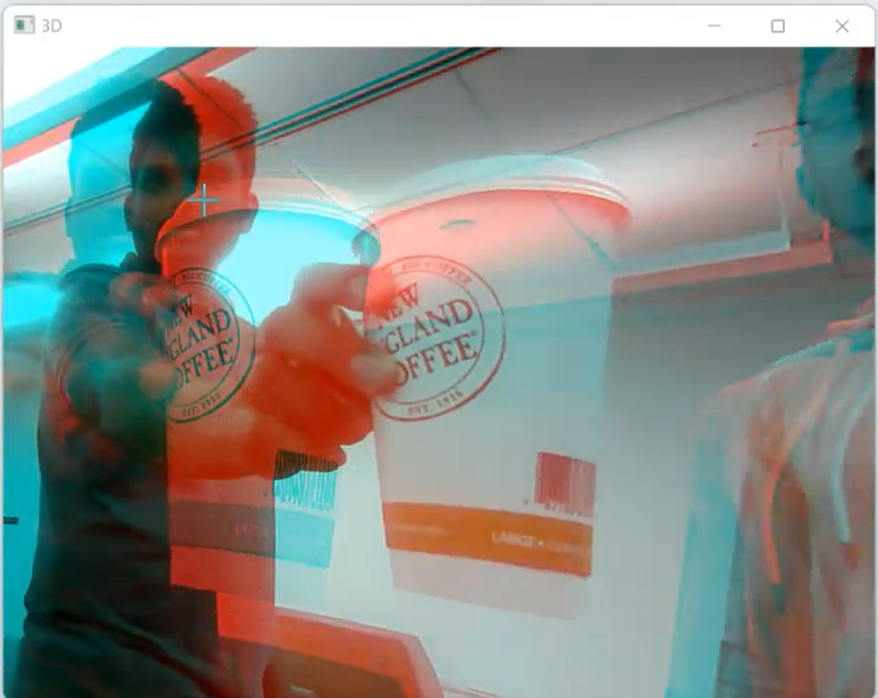

# StereoVision
StereoVision - CS 5330  
Stereo vision (stereopsis), which uses images from two cam-
eras to triangulate and estimate distances, is the most preva-
lent method for depth estimation in computer vision and
robotics. The goal is to take advantage of the parallax error.
The same scene is captured from two separate perspectives,
and depth is calculated using the parallax error. This strat-
egy has been around for over a century and has proven to be
beneficial in a variety of situations. In the field of robotics,
this system is extremely beneficial. Offering them estimated
object depths gives them a 3D understanding of the scene.
We use this further to this used for 3D reconstruction of the
place or obstacle avoidance for an autonomous vehicle. We
use two web cameras stuck onto a hardboard as the stereo
vision setup.

# Running the code
There are 3 main files for disparity maps in the src folder. 
- running best_pairs.py will store 
best images that can be used for finding the fundamental matrix.
- running stereo_rectification.py will compute the fundamental 
matrix using one of the best_pair images. This finds the map
H1 and H2 and save the matrices in the rectification folder. 
If the camera setup is fixed, i.e if both the cameras' relative 
positons are fixed, these H1 and H2 maps are all we need to 
compute epipolar lines and rectify images.
- Running the disparity_map.py runs the stereo setup with H1.npy
H2.npy as the mapping function and shows the disparity_map.
- To run the 3D output, use the notebook 3D_Video.ipynb.
# Output Results
## SIFT features

## FLANN Matching

## Epipolar lines

## Stereo Rectification

## Disparity Map

## 3D Video

 